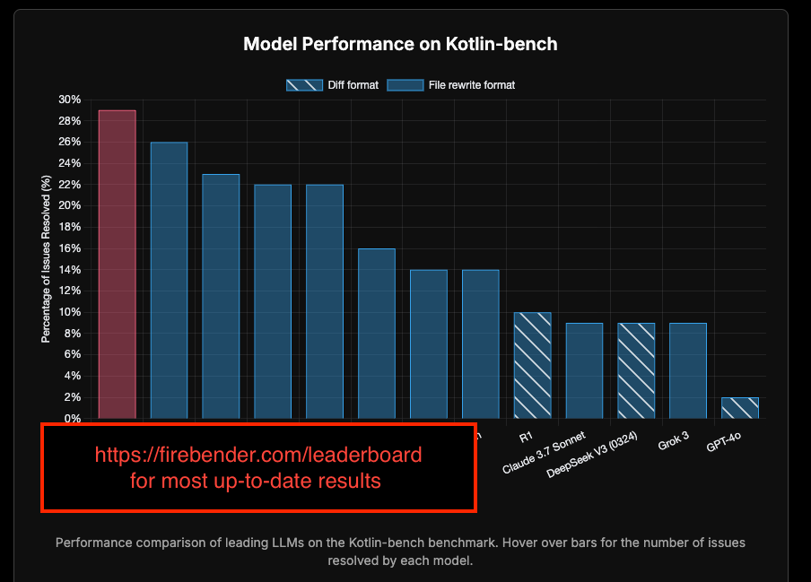

## See latest [results](https://firebender.com/leaderboard)



## 📰 Changelog
* **[Apr. 3, 2025]**: Firebender team introduces Kotlin-bench in this [blog post](https://firebender.com/blog/kotlin-bench).

## 👋 Overview

Kotlin-bench is a spinoff of [SWE-bench](https://www.swebench.com/) and is the first benchmark that evaluates Large Language Models (LLMs) and AI agents on 100 real-world Kotlin and Android software engineering tasks. It was created and maintained by the engineering team behind [Firebender](https://firebender.com).

Given a *codebase* and an *issue*, a language model is tasked with generating a *patch* that resolves the described problem.


## 🚀 Set Up
To build Kotlin-bench from source, follow these steps:
1. Clone this repository locally
2. `cd` into the repository.
3. Run `pipenv shell` to created a Python environment
4. Install dependencies `pip install -r requirements.txt`

## 💽 Usage
To use Kotlin-bench, you can:
*  Run Kotlin-bench's [data collection procedure](tutorials/collection.md) on your own repositories, to make new Kotlin-bench tasks. 
* [Evaluate](tutorials/evaluation.md) models against Kotlin-bench. This is where you take a Kotlin-bench task and a model-proposed solution and evaluate its correctness. 

## ⬇️ Downloads
| Datasets
| - 
| [🤗 Kotlin-bench](https://huggingface.co/datasets/firebenders/Kotlin-bench)
| [🤗 Kotlin-bench w/ Full file rewrite + "Oracle" Retrieval Context](https://huggingface.co/datasets/firebenders/Kotlin-bench__full_file_gen__fs-oracle)
| [🤗 Kotlin-bench w/ Patch diff + "Oracle" Retrieval Context](https://huggingface.co/datasets/firebenders/Kotlin-bench__style-3__fs-oracle)

## 💫 Contributions
We would love to hear from the Kotlin & Android community interested in contributing!

Join our [Discord](https://discord.gg/WB4VnjR4RA) community for fast responses.

Feel free to email me directly at aman@firebender.com

## Citations
```
@inproceedings{
    jimenez2024swebench,
    title={{SWE}-bench: Can Language Models Resolve Real-world Github Issues?},
    author={Carlos E Jimenez and John Yang and Alexander Wettig and Shunyu Yao and Kexin Pei and Ofir Press and Karthik R Narasimhan},
    booktitle={The Twelfth International Conference on Learning Representations},
    year={2024},
    url={https://openreview.net/forum?id=VTF8yNQM66}
}
```

## 🪪 License
MIT. Check `LICENSE.md`.

## What is Firebender?

Firebender, is Cursor but for Android Studio. It's the best coding agent in Android Studio and Jetbrains IDEs, with integrations into the preview window, kotlin LSP, and more. Here's a [30-second](https://firebender.com/blog/cursor-for-android-studio) walkthrough!
